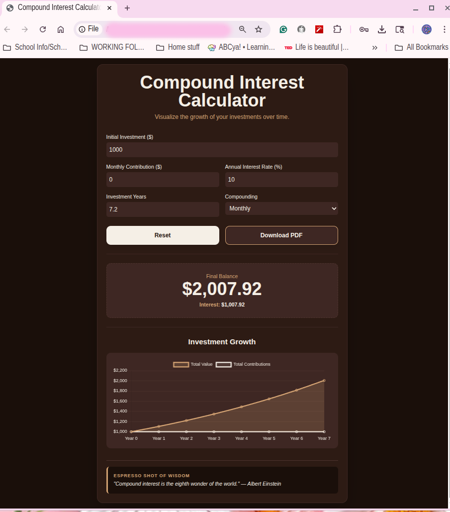

# ☕ Compound Interest Calculator & Visualizer

A responsive, client-side web application designed to project long-term investment growth. Built with vanilla JavaScript and Tailwind CSS, it features real-time dynamic compounding calculations, interactive Chart.js visualizations, and instant PDF report generation.

---

## ✨ Key Features

* **Real-Time Growth Calculations:** Instantly updates projected final balances, total contributions, and compound interest earned as inputs change.
* **Flexible Compounding Frequency:** Supports Annual, Monthly, and Daily compounding schedules using exact interest formulas.
* **Interactive Data Visualization:** Integrates **Chart.js** to render dynamic line graphs comparing total portfolio value against principal contributions over time.
* **Client-Side PDF Export:** Utilizes **jsPDF** to generate a downloadable, formatted summary report (`Investment_Scenario.pdf`) directly from the browser.
* **Dynamic Financial Wisdom:** Displays rotating financial tips and quotes ("Espresso Shot of Wisdom") on each calculation or reset.
* **Custom Coffee-Themed UI:** Clean, dark-mode design styled using **Tailwind CSS**.

---

## 🛠️ Tech Stack

* **Frontend:** HTML5, JavaScript (ES6+)
* **Styling:** [Tailwind CSS](https://tailwindcss.com/) (via CDN)
* **Data Visualization:** [Chart.js](https://www.chartjs.org/)
* **Document Generation:** [jsPDF](https://github.com/parallax/jsPDF)

---

## 🧮 Mathematical Model

The calculator models growth using standard compound interest formulas:

1. **Compound Interest on Principal ($P$):**
   $$A_{principal} = P \left(1 + \frac{r}{n}\right)^{nt}$$

2. **Future Value of Periodic Contributions ($PMT$):**
   $$A_{contributions} = PMT \times \frac{\left(1 + \frac{r}{n}\right)^{nt} - 1}{\frac{r}{n}}$$

Where:
* $P$ = Initial Investment Principal
* $PMT$ = Monthly Contribution Amount
* $r$ = Annual Interest Rate (decimal)
* $n$ = Compounding frequency per year ($1, 12, 365$)
* $t$ = Total Investment Period (Years)

🚀 Getting Started

    Download or clone the project files.

    Open index.html in your web browser.

    Input your financial details and watch the magic happen instantly!

📸 Screenshots

✨ Future Plans

    Add a yearly breakdown table to see the exact value of your investment at the end of each year.

    Include an option to factor in a one-time withdrawal to see its impact on future growth.
